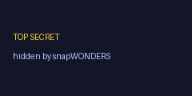

# Walkthrough — inputs, outputs & a real analyse result

What each example actually produces, using the bundled sample image. Everything below was generated by
running the scripts in this folder against the live API.

> The bundled `sample.png` is an **AI-generated image that carries C2PA Content Credentials**. Analyse
> grades it **D** — the honest provenance metadata is a positive authenticity signal, so it scores
> better than an image with no provenance at all, but it is still not an original photograph. Swap
> `assets/sample.png` for a real photo and re-run to see a higher grade —
> `node examples/analyse.mjs your-photo.jpg`.

---

## 1. Steganography — `hide_and_reveal.py`

Hide a secret image inside a cover image. The output is **visually identical** to the cover — that is
the whole point — but it carries the hidden file, recoverable only with the password.

| Secret (hidden inside) | Cover (input) | Stego output (carries the secret) |
|---|---|---|
|  |  |  |

`reveal()` with the same password extracts the secret back out. The stego output is a **lossless**
image (here WebP) — re-encoding it to a lossy format would destroy the hidden data.

---

## 2. Forensic analysis — `analyse.py`

`client.analyse.run([...])` grades each file, returns the forensic **verdicts**, and gives
downloadable overlays.

The full response is [`sample-output/analyse-result.json`](sample-output/analyse-result.json).
Abridged:

```jsonc
[
  {
    "name": "sample.png",
    "grade": "D",
    "face_count": 0,
    "text_region_count": 0,
    "watermark_flagged": false,
    "verdicts": {
      "ai_generation": { "verdict": "possible_aigc" },
      "c2pa": { "verdict": "valid", "applicable": true, "has_manifest": true, "trusted": true },
      "camera_fingerprint": { "matched": true, "encoder_name": "Adobe Photoshop",
                              "encoder_family": "adobe", "quality_level": 90 },
      "findings": [
        { "label": "Declared AI-generated (C2PA Content Credentials)", "severity": "info" },
        { "label": "No camera capture metadata present", "severity": "medium" },
        { "label": "Noise pattern inconsistent with a single capture", "severity": "high" }
      ]
    },
    "assets": [
      { "asset_id": "…", "category": "forensic_noise_map", "mime_type": "image/jpeg",
        "file_size": 298396, "download_path": "/api/analyse/asset/…" }
    ]
  }
]
```

- **`verdicts`** — the curated, user-safe forensic verdicts (mirrors what the web report shows, never
  internal data): `ai_generation.verdict`, `c2pa.{verdict,applicable,has_manifest,trusted}`,
  `camera_fingerprint.{matched,encoder_name,encoder_family,quality_level}` (the device match itself,
  never any underlying signature), and `findings[].{label,severity}`. In the SDK: `item.verdicts`.
- **`grade`** — overall A–F forensic grade (`D` here — see the note at the top). The grade also
  factors in C2PA/provenance, which is why this AI sample scores `D` rather than `F`.
- **`assets`** — downloadable overlay maps (`asset.download(...)`); each has a relative `download_path`.

---

## 3. Conversion — `convert.py`

`client.convert.run([...], image_format="webp")` re-encodes media. Input → output:

| Input (`sample.png`) | Output (`webp`) |
|---|---|
|  |  |

Formats: `image_format` = `jpeg` `png` `webp` `avif` `heic` `jxl`; video uses `video_format`.

---

*Regenerate every artifact in `sample-output/` by running the three example scripts with a valid
`SNAPWONDERS_API_KEY`.*
